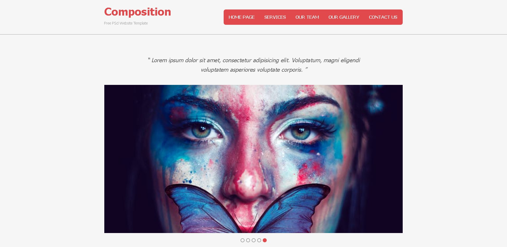
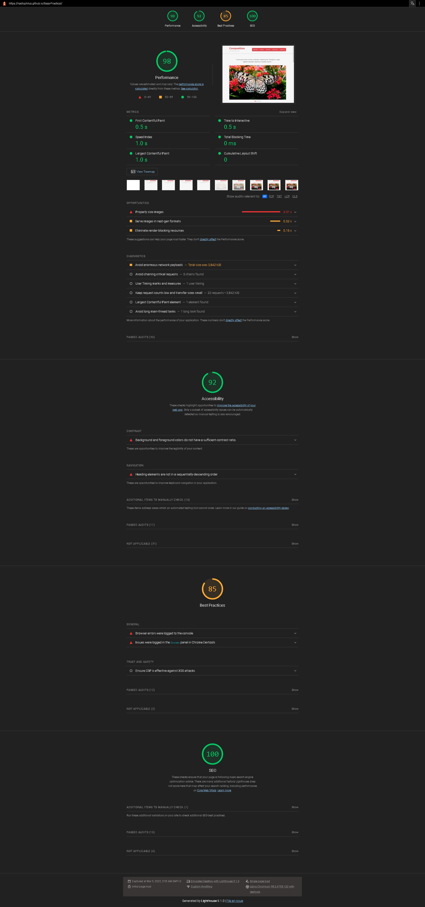

# <a>Composition | Sass Practice Template </a>

<h3>Composition -- Sass Practical Template 🤳</h3>

# Sass-Practical

<menu>
  <li>Created Reusable Mixins.</li>
  <li>Used Placeholders %.</li>
  <li>Advanced Solid Environment Structure.</li>
  <li>Fully responsive on each device even tinny mobiles.</li>
  <li>99% preformance ... 100% SEO.</li>
</menu>

 
 

    
Website Stats Report

    

 
 
 

- Original Design: OS Templates

   
   
   
  🤩 Leave a :star:&nbsp;if you like it, Please!

 

📫 Please hit me up at mohammed.yuossry@gmail.com if you have any feedback or improvements.
